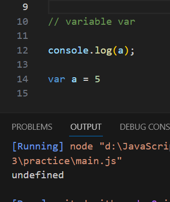
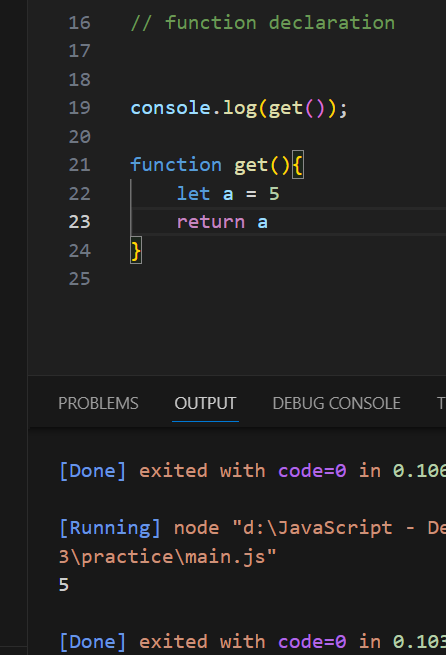

# Scope
В JavaScript область видимости определяет доступность переменных, объектов и функций из разных частей кода. В JavaScript есть 4 типа областей видимости: Block scope, Function scope, Global scope и Module scope. 

- Block scope (Область видимости блока) - введена в ES6 (2015) с ключевыми словами let и const. Переменные, объявленные внутри блока { }, не могут быть доступны извне блока.

- Function scope (Область видимости функции) создается с помощью функции. Переменные, определенные внутри функции, недоступны извне функции . 

- Global scope (Глобальная область) — это область по умолчанию для всего кода, выполняемого в режиме скрипта. Переменная, объявленная вне определения функции, является глобальной переменной, и ее значение доступно и изменяется во всей программе 

# Hoisting  
Hoisting — это поведение JavaScript по умолчанию, заключающееся в перемещении объявлений вверх.
`Hoisting - работает только в переменной var и функции declaration`

1. Hoisting - в переменной `var`
hoisting работает в переменной var, но показывает «undefined»

2.Hoisting - в функция `declaration`

И hoisting не работает в других функциях и переменных. он показывает ошибку TDZ

`Что такое ошибка TDZ`

Ошибка TDZ (Temporal Dead Zone) - это состояние, когда переменные находятся в области видимости, но не объявлены. Переменные let и const существуют в TDZ с начала своей охватывающей области до тех пор, пока они не будут объявлены 12. Это состояние возникает, когда переменные let и const используются до их объявления. Ошибка TDZ связана с областью видимости и поднятием переменных в JavaScript 
